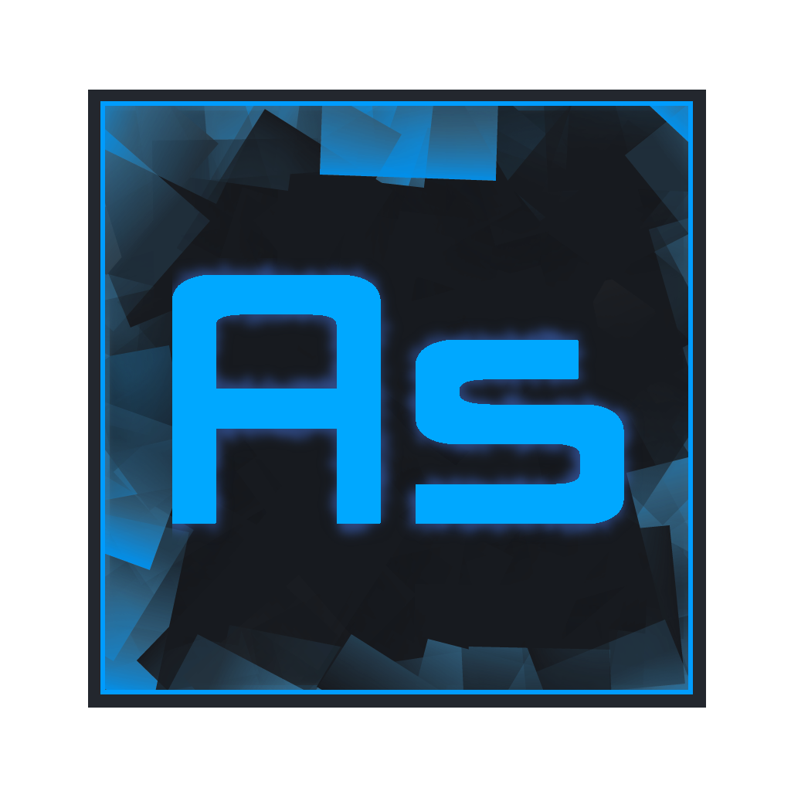

# AvalonStudio

An extensible, cross platform IDE written in C#

[](https://ci.appveyor.com/project/danwalmsley/avalonstudio)

[](https://travis-ci.org/VitalElement/AvalonStudio)

[](https://gitter.im/VitalElement/AvalonStudio?utm_campaign=pr-badge&utm_content=badge&utm_medium=badge&utm_source=badge)
Cross platform IDE on Avalonia for Avalonia

## Try the bleeding-edge builds?
|         |Version |Installers|
|---------|:------:|:------:|:------:|
|**Windows 7 8.1 10 x64**|[]|[Download](https://ci.appveyor.com/api/projects/danwalmsley/avalonstudio/artifacts/AvalonStudio-win7-x64.zip)|
|**MacOSX 10.12 x64**|[]|[Download](https://ci.appveyor.com/api/projects/danwalmsley/avalonstudio/artifacts/AvalonStudio-osx.10.12-x64.zip)|
|**Ubuntu 14.04+ x64**|[]|[Download](https://ci.appveyor.com/api/projects/danwalmsley/avalonstudio/artifacts/AvalonStudio-ubuntu.14.04-x64.zip)|
|**Debian 8 x64**|[]|[Download](https://ci.appveyor.com/api/projects/danwalmsley/avalonstudio/artifacts/AvalonStudio-debian.8-x64.zip)|

## Building from source

### Getting the code

Clone the repo.
```
git clone https://github.com/VitalElement/AvalonStudio --recursive

cd AvalonStudio
```

Then install dependencies.

- Windows should work out-of-the box (assuming you have .NET installed)
- `mono-complete` and some build compatibility scripts on Linux
- [Download Mono for macOS](http://www.mono-project.com/download/#download-mac)


A script for Linux users:
```
sudo ./dependencies.sh
```

### Building the project

#### Windows

- Open the solution in Visual Studio 2015
- Restore NuGet packages (don't forget to add the following package feeds:)
  - `Avalonia`: <https://www.myget.org/F/avalonia-ci/api/v2>
  - `XamlBehaviors`: <https://www.myget.org/F/xamlbehaviors-nightly/api/v2>
- Build the project for the `x86` platform (Skia doesn't work with AnyCPU)
- You should get binaries in `AvalonStudio\AvalonStudio\bin\x86\`, select the subdirectory for the appropriate configuration

#### Linux/macOS

Kick of the build with

```
sudo ./buildmono.sh
```

once build has completed.
```
cd AvalonStudio/bin/Release
mono AvalonStudio.exe
